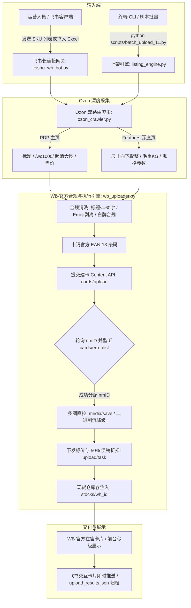

# Ozon to Wildberries (WB) Fast Listing Agent Skill & Workflow
## 俄罗斯跨境电商 Ozon 转 Wildberries 官方 API 极速智能上架与全量多图直传系统 (v3.0.0 旗舰闭环版)

[](LICENSE)
[]()
[](https://dev.wildberries.ru/)
[](https://open.feishu.cn/)

---

## 🌟 项目简介 (Overview)

**Ozon to Wildberries Fast Listing** 是专为俄罗斯跨境电商卖家与代运营团队打造的企业级全自动上架流水线与 AI Agent Skill。

该系统打通了从 **Ozon 商品数据精准穿透提取（PDP 主页 + Features 规格页双路由）**，到 **Wildberries 官方全合规校验建卡（标题≤60字符限制、Emoji 清洗、白牌脱敏、尺寸向下取整、官方条形码申请、多图直传、5倍售价折后标价、莫斯科现货仓库存秒级注入）** 的全链路闭环，并原生支持 **飞书 (Feishu / Lark) WebSocket 机器人交互**，实现运营人员在手机或电脑端飞书对话框内“发一个 SKU 或拖入一个表格，一键秒级上架至 Wildberries”。

---

## 🚀 核心特性 (Key Features)

### 1. 🔍 Ozon 双路由商品数据深度采集
- **PDP 主详情页 (`/product/{sku}/`)**：提取俄文原生标题、原厂 1000px+ 无水印超清相册（智能过滤底端推荐杂图）、实时售价、面包屑层级导航与当前变体色卡。
- **Features 深层规格页 (`/product/{sku}/features/`)**：穿透折叠属性，提取真实包装外箱长宽高（`Размер упаковки`）、毛重净重（`Вес`）、海关代码（`ТНВЭД`）等核心物理参数。

### 2. 🛡️ Wildberries 严苛官方合规与防错体系
- **标题智能截断**：严格遵循 WB 官方各品类**标题 ≤60 字符**限制，语义级断句截取，杜绝异步拒审。
- **描述字符清洗**：自动剥离所有 Emoji 表情符（如 `✅`、`💪` 等）与违规特殊符号，杜绝 Content API 拒卡。
- **尺寸整数取整**：包装尺寸严格执行 `Math.floor` 向下取整为纯整型（cm），彻底杜绝因浮点数导致的 400 Bad Request。
- **品牌白牌保护**：无官方授权品牌 100% 白牌脱敏处理，严防 WB《要约》(Оферта) 第 9.2.3 条第 7 款下架封店风险。
- **竞对平台痕迹剥离**：详情页描述全面剔除 Ozon SKU、商品数字编号（Код товара Ozon）与竞对标识，防止平台限流，保障卡片纯净合规。
- **货号冲突自愈**：检测到商家货号在店铺中已占用时，自动递增升级版本号（`-v1` ➔ `-v2` ➔ `-v3`）并自动重试。

### 3. ⚡ 极速全量多图与异步建卡流水线
- **官方 EAN-13 条码秒级申请**：直连 WB Content API 批量申请官方条形码。
- **双通道相册挂载**：首选云端异步直拉（`media/save`），遇超时自动平滑降级为本地二进制流直传（`media/file`），10~15 张高清原图秒级入库。
- **异步审核与错误侦测**：轮询 `cards/list` 抓取官方系统分配的 `nmID`，同步监听 `cards/error/list` 拦截任何异步拒绝原因。

### 4. 💰 跨境店铺人民币统一价格核算法则 (动态实售倍数 M / 2M 划线标价 / 50% 官方大促)
- **人民币结算账户原生适配**：跨境中国卖家在 Wildberries 开立的店铺以 **人民币（CNY）** 作为结算货币（`currencyIsoCode4217: "CNY"`），卖家后台、卡片标价与折扣价格 API 全部直接以 **人民币** 计价下发，彻底杜绝币种错位。
- **灵活实售倍数（支持 3 倍、5 倍、6 倍等任意倍数）**：
  - 用户可通过命令行参数 `--multiplier <float>`（如 `--multiplier 3.0` 或 `--multiplier 5.0`）或对话指令（“按 3 倍上架”、“5倍实售”）随时调整倍数 $M$；
  - 提取 Ozon 真实的绿标专享价对应的人民币价格 $P_{\text{ozon\_CNY}}$；
  - **后台实售折后目标价**：$P_{\text{sell\_CNY}} = P_{\text{ozon\_CNY}} \times M$（例如 3 倍实售为 $68.13 \times 3 = 204.39$ 元；6 倍实售为 $408.78$ 元）；
  - **后台划线标价（原价）**：$P_{\text{strike\_CNY}} = P_{\text{sell\_CNY}} \times 2 = P_{\text{ozon\_CNY}} \times (2M)$（例如 3 倍实售划线为 6 倍标价 409 元；6 倍实售划线为 12 倍标价 818 元）；
  - **API 整型约束化（四舍五入）**：满足 WB 标价整数规则，$P_{\text{strike}} = \text{round}(P_{\text{ozon\_CNY}} \times 2M)$，折后实售为 $\text{round}(P_{\text{strike}} \times 0.5)$。
- **买家前台卢布展示与平台补贴**：WB 平台前台按跨境汇率自动折算为卢布（如 5,100~5,200 ₽）展示并标注 **-50%** 大促标；若买家享有平台补贴（SPP），实付金额更低，差额由 WB 平台承担，卖家依然按设定的人民币实售价全额结算回款。
- **平滑阶梯调价防风控隔离**：自动识别降幅 > 50% 的调价请求，采用 0.70x 多轮步进平滑调价，彻底规避 WB 官方价格隔离区 (Карантин цен) 封禁。
- **实物物理包装尺寸与毛重智能推导**：杜绝全店单一假模板；根据容量（ml/g）、器皿形态（滴管瓶、圆罐面霜、泵头乳液）或工具类目（手提箱电钻 32x28x10cm/2.2kg）动态推导真实物理尺寸与毛重。
- **现货库存秒级注入**：莫斯科1仓（如 ID `2200658` 或 `2156484`）秒级写入在售现货。

### 5. 🔍 官方后台实时全量数据穿透核验 (Live Backend Verification)
- **四位一体 API 穿透核验**：拒绝本地虚报，直连 Content API（卡片状态）、Marketplace API（现货库存）、Discounts-Prices API（划线价/实售价/折扣率）与 Quarantine API（价格隔离监控）。
- **一键比对并生成 Markdown/JSON**：内置 `scripts/verify_backend_data.py`，全自动导出在售商品核心指标比对表格。

### 6. 🛡️ 价格隔离 (Price Quarantine) 与微服务索引 0 标价自动补推
- **价格隔离区快速诊断与放行指引**：针对单次降幅超 33.3% 被官方隔离的商品，提供状态扫描与卖家后台一键确认解禁 SOP。
- **微服务索引排队 0 标价自动补推 (`scripts/repush_indexed_prices.py`)**：针对 WB Content 与 Price 系统异步解耦导致新卡片入库初期 `price: 0` 不显价的痛点，自动监测新入库卡片并秒级补推 5 折精准价格。

### 7. 🗑️ 异常款式安全下架清零与移入回收站 (`scripts/clean_trash_cards.py`)
- **官方两步法安全删除**：针对误标极端高价或用户指示删除的款式，先调用仓库 API 将库存**置 0** 彻底阻断下单，再调用 `POST /content/v2/cards/delete/trash` 移入回收站，确保卡片彻底安全下架。

### 8. 🤖 飞书 (Feishu / Lark) 官方 WebSocket 机器人
- **免公网 IP、免内网穿透**：基于官方 WebSocket 长连接模式，局域网与个人电脑即启即用。
- **自然语言对话上架**：直接在群聊或私聊中发送纯 SKU 列表即可触发全流程。
- **Excel 文件拖拽批量上架**：直接向机器人发送 `.xlsx` 货盘表，自动解析多列并批量上架。
- **卡片式实时富文本推送**：建卡成功后即时下发带商品大图、货号、nmID、到手价及 WB 前台直达链接的精美交互卡片。

### 9. 🔐 会话级商业授权门禁、硬件一机一码与源码防复刻编译 (Mode B 商业版)
- **一机一码硬件指纹强绑定 (Machine ID Binding)**：支持通过 `获取机器码`（或 CLI `session_manager.py machine-id`）提取设备唯一主板与 CPU 指纹，跨设备拷贝授权码立即锁死。
- **RSA-2048 非对称防伪签名**：管理员私钥签名，客户端内置公钥验签，彻底杜绝离线伪造授权或篡改注册表文件。
- **零信任商业授权门禁**：新创建的 Antigravity 聊天窗口默认处于未授权状态 (`UNAUTHORIZED`)，未激活有效授权码强行阻断上架。
- **单窗口 1:1 店铺互斥锁定 (Store Mutex Lock)**：每一个对话窗口严格限制仅允许绑定一家 Wildberries 店铺，严禁混绑并发，彻底消除商品串店误传与库存错乱隐患。
- **平滑安全更换店铺**：支持通过 `切换店铺` 或 `解绑店铺` 指令秒级更换绑定的 WB 店铺，实时完成 API 验真与仓库更新。
- **一键商业保护打包构建器 (`scripts/build_protected_release.py`)**：一键调用 PyArmor 将核心脚本编译混淆为原生 `.pyd` 运行时与加密实体，私钥自动隔离，生成面向商业客户交付的干净保护包。

### 10. ☁️ Cloudflare Workers 云端鉴权网关、毫秒级远程封禁与用量看板 (Stage 2 商业化扩展)
- **零服务器成本 Serverless 架构**：依托 Cloudflare 免费版 Workers (每日 100,000 次请求) 与分布式 KV 存储 (`WB_LICENSES`)，无需租用 VPS 服务器；
- **毫秒级远程在线封禁与解封**：管理员可在 Web 商业控制台或终端一键封禁违规授权码，客户端在下一次交互或上架时毫秒级拦截并即刻锁死；
- **全网搬家用量实时统计看板**：客户每次成功上架自动向云端上报 SKU 总件数，管理员在 Web 现代暗黑看板 (`/admin`) 上实时掌握全网各商户活跃度与上架量；
- **高可用双模平滑回退 (Graceful Fallback)**：弱网或离线时自动无缝降级至本地 RSA-2048 硬件验签，兼顾管理控制力与商户使用稳定性；
- **极速部署指南与配套代码**：自带 [`cloud/worker.js`](./cloud/worker.js)、[`cloud/wrangler.toml`](./cloud/wrangler.toml) 与 2 分钟极速部署手册 [`cloud/DEPLOY_GUIDE.md`](./cloud/DEPLOY_GUIDE.md)。

---

## 🏗️ 系统架构图 (Architecture)



---

## 📁 目录结构 (Project Structure)

```text
ozon-to-wb-fast-listing/
├── SKILL.md                             # AI Agent 调用的标准化技能定义与执行铁律
├── README.md                            # 项目官方说明文档 (中英双语)
├── USER_MANUAL.md                       # 详细使用说明书与常见问题处理指南
├── FEISHU_INTEGRATION_GUIDE.md          # 飞书机器人 3 步免公网长连接对接白皮书
├── config.example.json                  # 配置文件模板 (含 Token、仓库 ID 与飞书凭证)
├── .gitignore                           # Git 忽略配置 (安全隔离真实密钥与临时日志)
├── references/                          # 规则契约与类目映射表
│   ├── category_mapping.json            # Ozon 与 Wildberries 类目映射字典
│   ├── category_display_charcs_guide.md # WB 类目展示参数与 maxCount 约束表
│   ├── sensitive_brands.txt             # 敏感商标品牌保护库 (白牌脱敏依据)
│   ├── input-schema.md                  # 标准输入数据结构契约规范
│   └── two_tier_architecture.md         # WB 买家端两级渲染与 CDN 切片技术规范
├── scripts/                             # 端到端工具链与业务脚本
│   ├── ozon_crawler.py                  # Ozon 商品数据双路由爬虫提取器
│   ├── wb_uploader.py                   # Wildberries 官方 API 全链路独立上架客户端
│   ├── listing_engine.py                # WB 全自动极速批量上架编排引擎
│   ├── feishu_wb_bot.py                 # 飞书官方 WebSocket 长连接交互机器人
│   ├── batch_upload_11.py               # 批量逐一上架流水线脚本 (支持增量断点续传)
│   ├── clean_descriptions.py            # 俄文乱码清洗与特殊符号脱敏工具
│   ├── enrich_charcs_pipeline.py        # 买家端展示参数探测与饱和注入工具
│   ├── audit_deliverability.py          # 全店商品可交付性多维自动化审计工具
│   ├── check_cdn_slice.py               # 买家端 CDN 静态切片编译探测工具
│   ├── verify_backend_data.py           # WB 官方后台全量数据穿透实时核验工具 (4大官方API比对)
│   ├── clean_trash_cards.py             # 异常高价卡片安全下架销毁工具 (先清零库存再移入回收站)
│   ├── repush_indexed_prices.py         # WB 微服务异步目录索引排队扫描与 0 标价自动补推工具
│   ├── browser_snapshot.js              # 无头浏览器无痕抓取探针
│   └── preview.py                       # 卡片渲染与本地预览辅助工具
├── templates/                           # 业务模板
│   └── WB批量上架模板.xlsx               # 飞书机器人支持的 Excel 货盘导入模板
└── tests/                               # 自动化单元测试
    └── test_listing_engine.py           # 核心逻辑自动化测试套件
```

---

## ⚙️ 快速开始 (Quickstart)

### 1. 克隆项目与安装依赖

```bash
git clone https://github.com/cnproduct/ozon-to-wb-fast-listing.git
cd ozon-to-wb-fast-listing

# 安装 Python 核心依赖
pip install requests lark-oapi openpyxl
```

### 2. 配置专属密钥与仓库 (`config.json`)

复制配置模板：
```bash
cp config.example.json config.json
```

编辑 `config.json` 填入您的真实信息：
```json
{
  "wb_api_token": "YOUR_WILDBERRIES_API_TOKEN",
  "wb_warehouse_id": 2156484,
  "default_multiplier": 5.0,
  "default_discount": 50,
  "default_stock": 10,
  "feishu_app_id": "cli_xxxxxxxxxxxx",
  "feishu_app_secret": "xxxxxxxxxxxxxxxxxxxxxxxx"
}
```

> ⚠️ **安全警告**：`config.json` 已经被 `.gitignore` 保护，切勿将其提交到公共版本库中！

---

## 💻 命令行执行示例 (CLI Usage)

### 模式 A：从 Ozon SKU 批量上架

```bash
# 1. 提供 SKU 列表抓取商品数据并生成 products.json
python scripts/ozon_crawler.py --skus "3461665428,3521064413,161568950" --output products.json

# 2. 一键批量上传至 Wildberries (售价5倍、标价10倍50%折、库存10件)
python scripts/batch_upload_11.py
```

### 模式 B：启动飞书机器人常驻服务

详细配置步骤请参阅 [飞书对接指南 (FEISHU_INTEGRATION_GUIDE.md)](./FEISHU_INTEGRATION_GUIDE.md)。

```bash
python scripts/feishu_wb_bot.py
```
启动后，直接在飞书私聊发送：
```text
3461665428
3521064413
售价6倍，库存5
```
机器人将自动处理抓取、合规建卡、传图、打折与现货上架，并实时回传 WB 在售链接卡片！

### 模式 C：极速全自动流水线上架 (Fast Listing Production Engine)

只要提供 SKU 列表或包含 SKU 的 `.txt` 文本文件路径，即可一气呵成完成“自动查重 -> 抓取 -> EAN条码 -> 原生weightBrutto建卡 -> 异步超清相册 -> 莫斯科1仓现货库存 -> 50%大促纯卢布折扣 -> 本地归档”十二步全流程：

```bash
# 方式 1: 直接输入 SKU 列表或 .txt 文档路径
python scripts/fast_list.py --skus "skus.txt" --batch-size 25 --stock 5 --multiplier 6.0

# 方式 2: 逗号/空格分隔的数字 SKU
python scripts/fast_list.py --skus "3149221235, 1746056982, 177045040"
```

### 模式 D：全店卡片毛重与 50% 官方大促折扣全量修复巡检 (Weight & Promo Enforcer)

自动扫描全店卡片，识别缺失毛重与 `isValid=False` 的卡片，自动隔离官方封禁卡片并单件降级容错写入公斤毛重；同时对齐下发 Rule 2 纯卢布 12 倍标价与 50% 官方大促折扣：

```bash
python scripts/update_weights_and_promos.py
```

---

## 📄 开源许可证 (License)

本项目遵循 [MIT License](LICENSE)。欢迎提交 Issue 与 Pull Request！
